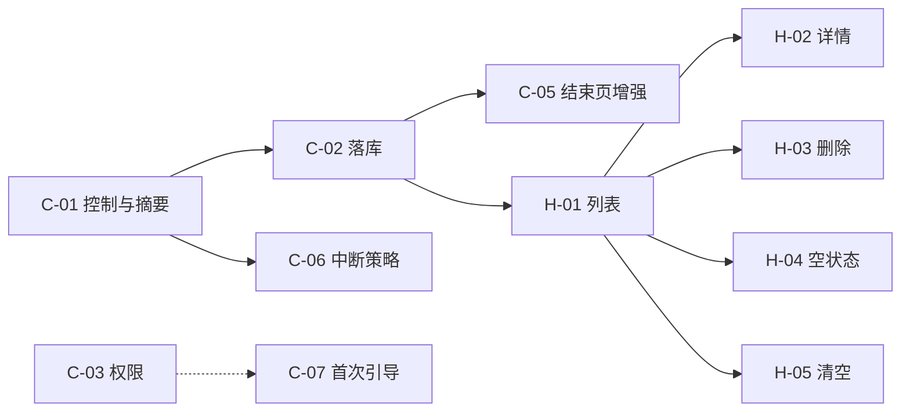

# 子 PRD 索引（按实现顺序）

主 PRD：`docs/prd.md`。

本目录每个文件对应**一个可交给 Cursor 单独实现**的小需求：范围小、验收清晰、尽量自洽闭环。  
**AI 投喂总约定**（首条消息怎么组、依赖怎么处理、Gradle 怎么验）：[`CURSOR-FEED.md`](./CURSOR-FEED.md) — **开干前先读一遍**。每个子 PRD 文末另有**可复制首条模板**（含 ID 与 `PRD:` 行）。

**推荐实现顺序**如下（先打通「开始」主流程，再接「历史」读同一数据源，最后「我的」接主流程配置）。

| 顺序 | ID | 文档 | Tab | 依赖 | 闭环说明 |
|------|-----|------|-----|------|-----------|
| 1 | C-01 | [counter-01-training-controls-and-summary.md](./counter-01-training-controls-and-summary.md) | 开始 | 无 | 训练状态机 + 结束摘要（可先不落库） |
| 2 | C-02 | [counter-02-persist-session-on-end.md](./counter-02-persist-session-on-end.md) | 开始 | C-01 | 结束确认后写入本地会话 |
| 3 | C-03 | [counter-03-camera-permission-rationale.md](./counter-03-camera-permission-rationale.md) | 开始 | 无* | 权限说明 / 拒绝 / 去设置 |
| 4 | C-04 | [counter-04-pose-presence-hint.md](./counter-04-pose-presence-hint.md) | 开始 | 无* | 画面内提示「未检测到人体」等 |
| 5 | C-05 | [counter-05-end-summary-quality-and-adjust.md](./counter-05-end-summary-quality-and-adjust.md) | 开始 | C-02 | 结束页质量信号 + 手动 ±1 写回 |
| 6 | C-06 | [counter-06-session-interrupt-policy.md](./counter-06-session-interrupt-policy.md) | 开始 | C-01 | 后台/锁屏等中断时行为与文案 |
| 7 | C-07 | [counter-07-first-run-placement-guide.md](./counter-07-first-run-placement-guide.md) | 开始 | C-03 建议 | 首次 ≤3 步摆放引导 |
| 8 | H-01 | [history-01-session-list.md](./history-01-session-list.md) | 历史 | C-02 | 列表展示已存会话 |
| 9 | H-02 | [history-02-session-detail.md](./history-02-session-detail.md) | 历史 | H-01 | 详情页 |
| 10 | H-03 | [history-03-delete-one-session.md](./history-03-delete-one-session.md) | 历史 | H-01 | 单条删除 + 确认 |
| 11 | H-04 | [history-04-empty-state-cta.md](./history-04-empty-state-cta.md) | 历史 | H-01 | 空列表引导去「开始」 |
| 12 | H-05 | [history-05-clear-all-sessions.md](./history-05-clear-all-sessions.md) | 历史 | H-01 | 清空全部 + 二次确认 |
| 13 | P-01 | [profile-01-sound-effect-toggle.md](./profile-01-sound-effect-toggle.md) | 我的 | 无* | 音效开关持久化并影响训练 |
| 14 | P-02 | [profile-02-tts-toggle.md](./profile-02-tts-toggle.md) | 我的 | 无* | 语音播报开关持久化 |
| 15 | P-03 | [profile-03-jump-sensitivity-preset.md](./profile-03-jump-sensitivity-preset.md) | 我的 | 无* | 灵敏度档位接入检测参数 |
| 16 | P-04 | [profile-04-about-version-legal-links.md](./profile-04-about-version-legal-links.md) | 我的 | 无 | 版本号 + 协议/隐私链接 |
| 17 | P-05 | [profile-05-feedback-entry.md](./profile-05-feedback-entry.md) | 我的 | 无 | 反馈入口（mailto 或 URL） |

\* 与 C-01 无硬依赖，但与「开始」页同屏时建议实现顺序放在主流程骨架之后，避免反复改 UI。

**与主 PRD 对齐**：手动纠偏以 **C-05（结束页）** 为当前索引内的 P0 闭环；**训练中**实时 ±1 未单独拆子 PRD 前不纳入必达。历史侧 **H-01** 为时间倒序平面列表；按日/周聚合、备注编辑、FAQ 页等见主 PRD `docs/prd.md` 第 4 节与 1.x 表述。

### 按顺序喂给 Cursor 时建议流程

1. **单 chat = 单个子 PRD 文件**；不要把下一行的需求混在同一轮大改里。  
2. 首条消息：遵守 [`CURSOR-FEED.md`](./CURSOR-FEED.md) 第 1 节结构；子 PRD 文末 **「Cursor 对话（AI 提示）」** 里有一段可直接复制的 `>` 引用块。  
3. 依赖未在主干满足时：先完成依赖项的 PR，或在本 PR 中只做占位并在说明里标注阻塞（见 `CURSOR-FEED.md` 第 2 节）。  
4. 合并前尽量跑通 `CURSOR-FEED.md` 第 4 节的本地命令；PR / commit 说明首行 **`PRD: <该子文档文件名>`**。
